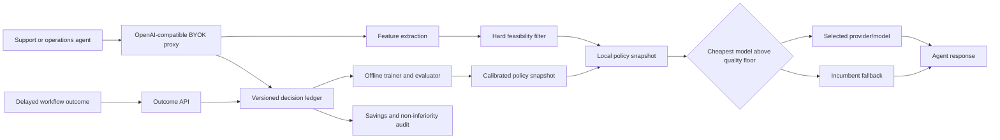

# Architecture

## Request path

The Go service performs bounded parsing and feature extraction, then executes a
local policy snapshot. There is no policy-service network hop and no
LLM-as-router call. Hard constraints are evaluated before predictions.

The selected model is attempted first. Retryable provider failures may advance
through configured fallback models and finally the incumbent, but only when
the fallback remained feasible for the original request.

## Learning path

Decisions are written before the upstream call so every attempted request has
an audit record. A later upsert adds final model, upstream status, usage, cost,
latency, and completion state.

Outcomes can reference a decision or a trace. A trace-level final outcome is
joined to all production steps for training, but is counted once per trace in
the controlled audit.

The first learner is a calibrated per-model logistic predictor over:

- input and expected output tokens
- conversation depth
- tool count
- vision and structured-output requirements
- risk score
- workflow-specific subsets when enough labels exist

## Storage

Local development uses append-only JSONL with latest-record reconstruction.
Production uses PostgreSQL JSONB plus indexed routing dimensions. The same
repository contract supports both.

Prompts and model responses are intentionally absent from durable records.
Customers can attach nonsensitive metadata to outcome events.

## Failure behavior

| Condition | Behavior |
| --- | --- |
| Policy missing | Reject before provider call |
| Snapshot missing candidate labels | Candidate cannot route live |
| Snapshot or catalog drift | Incumbent |
| Provider circuit open | Remove its models before selection |
| Selected provider fails retryably | Next feasible fallback |
| Audit write fails before request | Fail closed; no unaudited inference |
| Audit completion write fails | Response continues; error is logged |
| Shadow budget exhausted | Skip shadow call |
